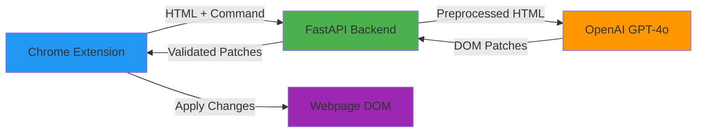

# DOM Patch Assistant - AI-Powered Web Page Manipulation

> Transform any webpage with natural language commands

[](docs/WORKING_WITH_BOB.md)


**DOM Patch Assistant** is an intelligent Chrome extension that lets you modify any webpage using natural language. Simply describe what you want to change, and watch as AI-powered DOM manipulation transforms the page in real-time—no coding required.

---

## ✨ Features

- 🎯 **Natural Language Interface** - Describe changes in plain English
- 🔄 **Real-time DOM Manipulation** - See changes applied instantly
- 🎨 **Smart Styling** - Intelligent CSS generation and application
- 🧩 **Selector Stability** - Robust element targeting that survives page updates
- 📊 **Multiple Processing Modes** - Optimized pipelines for different HTML sizes
- 🔍 **Context-Aware** - Understands page structure and semantics
- 🚀 **Fast & Efficient** - Optimized token usage and processing

> **🤖 Built with Bob AI**
> 
> This project's architecture, implementation, and documentation were developed in collaboration with Bob, an AI coding assistant. Bob helped design the modular pipeline architecture, implement robust error handling, optimize token usage, and create comprehensive documentation. [Read the full collaboration story →](docs/WORKING_WITH_BOB.md)

---

## 🏗️ Architecture



### Key Components

1. **Chrome Extension** (`ibm-extension-v4/`)
   - Content script for DOM interaction
   - Background service worker for API communication
   - Popup UI for user commands

2. **FastAPI Backend** (`backend/`)
   - Modular preprocessing pipeline
   - AI client with retry logic and token optimization
   - Multiple processing modes (full HTML, skeleton, chunked)
   - Robust error handling and validation

3. **AI Integration**
   - OpenAI GPT-4o for intelligent patch generation
   - Structured output with JSON schema validation
   - Context-aware prompt engineering

> **Bob's Architectural Contribution:** The modular pipeline design with pluggable preprocessors, mode-based routing, and comprehensive error handling was architected in collaboration with Bob, ensuring scalability and maintainability.

---

## 🚀 Quick Start

### Prerequisites

- Python 3.11+
- Node.js 18+ (for extension development)
- OpenAI API key
- Chrome/Chromium browser

### Backend Setup

```bash
# Navigate to backend directory
cd backend

# Install dependencies
pip install -r requirements.txt

# Configure environment
cp .env.example .env
# Edit .env and add your OPENAI_API_KEY

# Run the server
uvicorn app.main:app --reload --host 0.0.0.0 --port 8000
```

The backend will be available at `http://localhost:8000`

### Extension Setup

1. Open Chrome and navigate to `chrome://extensions/`
2. Enable "Developer mode" (toggle in top-right)
3. Click "Load unpacked"
4. Select the `ibm-extension-v4/` directory
5. Configure the backend URL in extension options (default: `http://localhost:8000`)

### First Use

1. Navigate to any webpage
2. Click the extension icon in Chrome toolbar
3. Enter a natural language command, e.g.:
   - "Make all headings blue"
   - "Hide the sidebar"
   - "Add a red border to all images"
4. Click "Apply Changes" and watch the magic happen! ✨

---

## 📚 Documentation

- **[Working with Bob](docs/WORKING_WITH_BOB.md)** - Complete story of AI-assisted development
- **[Architecture Guide](ARCHITECTURE.md)** - Detailed system design and component overview
- **[Full HTML Pipeline](FULL_HTML_PIPELINE.md)** - Deep dive into HTML processing modes
- **[Backend README](backend/README.md)** - Backend-specific documentation and API reference
- **[Extension README](ibm-extension-v4/README.md)** - Extension architecture and development guide

---

## 💡 Example Use Cases

### Layout Modifications

```
"Move the navigation menu to the left side"
"Make the main content area wider"
"Center all images on the page"
```

### Styling Changes

```
"Change all blue text to green"
"Make headings bold and uppercase"
"Add rounded corners to all buttons"
```

### Content Reorganization

```
"Hide all advertisements"
"Show only the main article content"
"Remove the footer section"
```

---

## 🛠️ Technology Stack

### Backend

- **FastAPI** - Modern, fast web framework
- **Pydantic** - Data validation and settings management
- **OpenAI Python SDK** - AI integration
- **BeautifulSoup4** - HTML parsing and manipulation
- **Jinja2** - Prompt templating
- **PyYAML** - Configuration management

### Frontend (Extension)

- **Chrome Extension Manifest V3** - Modern extension architecture
- **Vanilla JavaScript** - No framework dependencies
- **Chrome APIs** - Tabs, scripting, storage, and messaging

### Development Tools

- **pytest** - Testing framework
- **Ruff** - Fast Python linter
- **Git** - Version control
- **VS Code** - Development environment

---

## 🤝 Bob Collaboration Highlights

This project was built in close collaboration with **Bob**, an AI coding assistant. Here's how Bob contributed:

### 🏛️ Architecture Design
- Designed the modular preprocessing pipeline with pluggable components
- Architected the mode-based routing system for different HTML sizes
- Implemented comprehensive error handling and validation strategies

### 💻 Implementation
- Developed the core DOM manipulation handler with robust selector generation
- Created the token-optimized HTML preprocessing pipeline
- Implemented retry logic with exponential backoff for API resilience

### 🐛 Problem Solving
- Debugged complex selector stability issues
- Optimized token usage for large HTML documents
- Resolved CSS specificity and injection challenges

### 📖 Documentation
- Created comprehensive technical documentation
- Wrote detailed architecture guides
- Documented the entire collaboration process

**[Read the full collaboration story →](docs/WORKING_WITH_BOB.md)**

---

## 🗺️ Roadmap

### ✅ Current Status (v1.0)

- ✅ Core DOM manipulation with natural language
- ✅ Multiple HTML processing modes
- ✅ Robust selector generation
- ✅ CSS injection and styling
- ✅ Chrome extension with popup UI
- ✅ Comprehensive documentation

### 🔮 Planned Features

- [ ] **Visual Selector Tool** - Click elements to target them
- [ ] **Undo/Redo System** - Revert changes easily
- [ ] **Preset Commands** - Save and reuse common modifications
- [ ] **Multi-page Sessions** - Apply changes across multiple tabs
- [ ] **Export Patches** - Save modifications as reusable scripts
- [ ] **Advanced Modes** - Theme transformations (dark mode, accessibility, etc.)
- [ ] **Collaborative Features** - Share modifications with others
- [ ] **Browser Support** - Firefox and Edge extensions

---

## 🤝 Contributing

Contributions are welcome! This project was built with AI assistance, and we encourage both human and AI-assisted contributions.

### Development Setup

```bash
# Clone the repository
git clone https://github.com/yourusername/dom-patch-assistant.git
cd dom-patch-assistant

# Set up backend
cd backend
pip install -r requirements.txt
cp .env.example .env

# Run tests
pytest

# Start development server
uvicorn app.main:app --reload
```

### Contribution Guidelines

1. Fork the repository
2. Create a feature branch (`git checkout -b feature/amazing-feature`)
3. Make your changes
4. Run tests and linting
5. Commit your changes (`git commit -m 'Add amazing feature'`)
6. Push to the branch (`git push origin feature/amazing-feature`)
7. Open a Pull Request

Please read our [Contributing Guide](CONTRIBUTING.md) for more details.

---

## 📄 License

This project is licensed under the MIT License - see the [LICENSE](LICENSE) file for details.

---

## 🙏 Acknowledgments

- **OpenAI** - For GPT-4o and the incredible API
- **Bob AI** - For being an exceptional coding partner throughout this project
- **FastAPI Community** - For the excellent framework and documentation
- **Chrome Extensions Team** - For the powerful extension platform

---

## 📧 Contact

- **Project Repository:** [github.com/yourusername/dom-patch-assistant](https://github.com/yourusername/dom-patch-assistant)
- **Issues:** [github.com/yourusername/dom-patch-assistant/issues](https://github.com/yourusername/dom-patch-assistant/issues)
- **Discussions:** [github.com/yourusername/dom-patch-assistant/discussions](https://github.com/yourusername/dom-patch-assistant/discussions)

---

<div align="center">

**Built with ❤️ and 🤖 by humans and AI working together**

[](docs/WORKING_WITH_BOB.md)

</div>