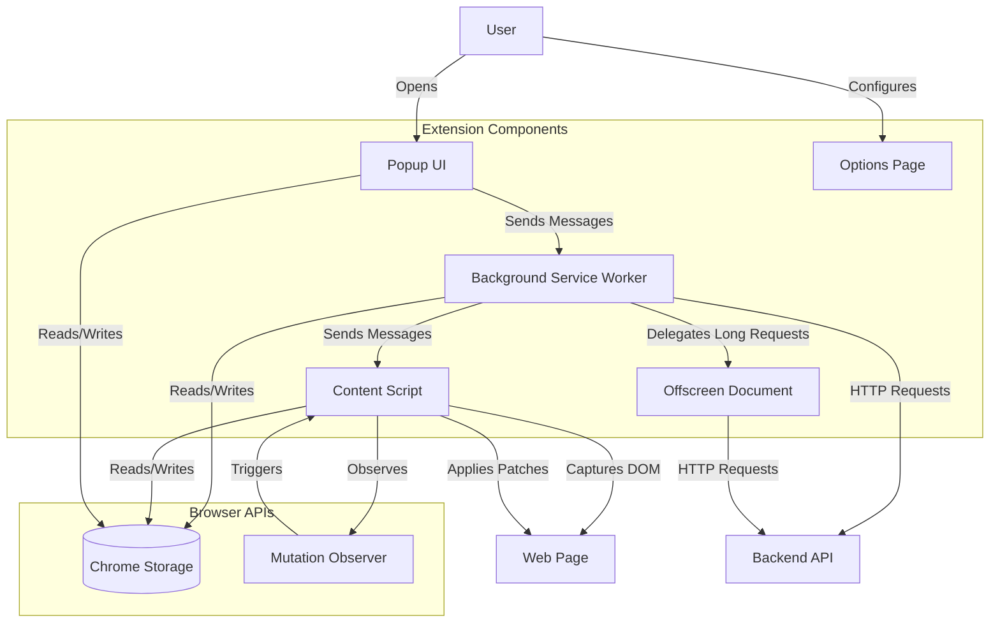
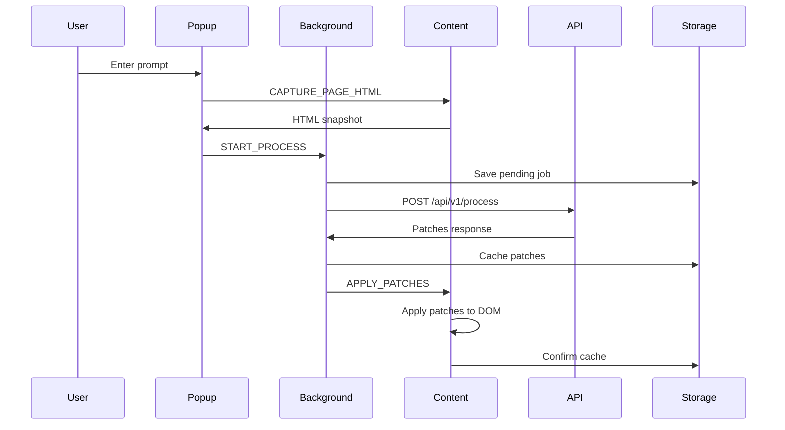

# Chrome Extension Guide

## Table of Contents

1. [Introduction](#introduction)
2. [Architecture Overview](#architecture-overview)
3. [Components](#components)
4. [Message Passing](#message-passing)
5. [Caching System](#caching-system)
6. [Patch Operations](#patch-operations)
7. [User Workflows](#user-workflows)
8. [Extension Permissions](#extension-permissions)
9. [Development](#development)
10. [Limitations & Known Issues](#limitations--known-issues)

---

## Introduction

The **DOM Patch Assistant** is a Manifest V3 Chrome extension that enables users to modify web pages using natural language prompts. The extension captures the current page's DOM, sends it to a backend API for AI-powered transformation, and applies the resulting patches to the live page.

### Key Features

- **Natural Language Commands**: Describe desired changes in plain English
- **Mode-Based Transformations**: Apply predefined styling modes (focus, modernization, etc.)
- **Persistent Caching**: Changes are cached per-page and automatically reapplied on reload
- **Version History**: Track and rollback to previous page versions
- **Live DOM Patching**: Applies changes without page reload, preserving JavaScript state
- **Dynamic Content Support**: Mutation observer reapplies patches to dynamically loaded content

### Manifest V3 Architecture

The extension uses Chrome's Manifest V3 architecture:

- **Service Worker**: Background script that handles API communication and orchestrates operations
- **Content Scripts**: Injected into web pages to capture DOM and apply patches
- **Popup UI**: User interface for entering commands and managing cache
- **Options Page**: Configuration for API endpoint and extension settings
- **Offscreen Document**: Handles long-running API requests outside the service worker lifecycle

---

## Architecture Overview

### Component Diagram



### Communication Flow

1. **User Interaction**: User enters a prompt in the popup
2. **DOM Capture**: Popup requests content script to capture page HTML
3. **API Request**: Background worker sends HTML + prompt to backend API
4. **Patch Generation**: Backend returns DOM manipulation patches
5. **Patch Application**: Content script applies patches to live DOM
6. **Caching**: Patches are cached in Chrome storage
7. **Auto-Reapplication**: On page reload, cached patches are automatically reapplied

### Data Flow



---

## Components

### Popup UI (`popup/`)

**Files**: `popup.html`, `popup.js`, `popup.css`

The popup provides the main user interface for interacting with the extension.

#### Features

- **Prompt Input**: Text area for entering natural language commands
- **Mode Selection**: Buttons for predefined transformation modes (loaded from backend)
- **Version Management**: Display current version and history with rollback capability
- **Status Display**: Real-time feedback on operations
- **Cache Management**: View and delete cached versions

#### Key Functions

```javascript
// popup.js key functions

// Load available modes from backend
async function loadModes()

// Capture page HTML and send to API
applyPrompt.addEventListener("click", async () => {
  const snapshot = await sendTabMessage(tab.id, { type: "CAPTURE_PAGE_HTML" });
  await sendRuntimeMessage({ type: "START_PROCESS", payload: {...} });
});

// Rollback to a previous version
async function rollbackVersion(versionId)

// Delete version from history
async function deleteHistoryVersion(versionId)
```

#### State Management

The popup maintains per-tab state in Chrome storage:

```javascript
{
  draftPrompt: "",           // Current input text
  draftMode: null,           // Selected mode
  current: {...},            // Current active version
  history: [...],            // Previous versions
  nextIndex: 1,              // Version counter
  historyExpanded: false     // UI state
}
```

#### Version Structure

```javascript
{
  id: "uuid",                // Unique identifier
  index: 1,                  // Display number
  prompt: "user prompt",     // Original request
  mode: "focus",             // Selected mode key
  createdAt: "ISO date",     // Timestamp
  kind: "generated",         // "generated" or "original"
  result: {...},             // API response with patches
  pending: false             // Waiting for API
}
```

---

### Content Script (`src/content.js`)

**File**: `src/content.js`

The content script runs in the context of web pages and handles DOM capture and patch application.

#### Initialization

```javascript
(function bootDomPatchAssistant() {
  // Prevent double-loading
  if (window.__domPatchAssistantLoaded) return;
  window.__domPatchAssistantLoaded = true;
  
  // Auto-apply cached patches on page load
  (async () => {
    const { settings = { enabled: true } } = await chrome.storage.local.get("settings");
    if (!settings.enabled) return;
    
    await applyCachedPatches();
    chrome.runtime.sendMessage({ type: "PING_EXTENSION" });
  })();
})();
```

#### DOM Capture

The content script captures the live DOM with full fidelity:

```javascript
function createSnapshotHtml() {
  const clone = document.documentElement.cloneNode(true);
  let html = `<!doctype html>\n${clone.outerHTML}`;
  
  // Truncate if too large
  if (html.length > MAX_CAPTURED_HTML_CHARS) {
    html = html.slice(0, MAX_CAPTURED_HTML_CHARS);
    truncated = true;
  }
  
  const elementCount = clone.querySelectorAll("body, body *").length;
  return { html, elementCount, truncated };
}
```

**Key Points**:
- Clones the entire `documentElement` to avoid modifying the live page
- Includes `<script>`, `<style>`, and `<iframe>` tags (backend handles compression)
- Truncates at 2M characters to prevent memory issues
- Returns element count for statistics

#### Patch Application

The content script applies patches to the live DOM without replacing it:

```javascript
function applyOp(op) {
  const el = resolveTarget(op);
  if (!el) return;
  
  switch (op.op) {
    case "set_text":
      el.textContent = op.text;
      break;
    case "set_attr":
      if (op.value === null) el.removeAttribute(op.name);
      else el.setAttribute(op.name, op.value);
      break;
    case "set_style":
      mergeStyle(el, op.style);
      break;
    case "add_class":
      el.classList.add(op.class_name);
      break;
    case "remove_class":
      el.classList.remove(op.class_name);
      break;
    case "replace_inner":
      el.innerHTML = op.html;
      break;
    case "delete":
      if (el.parentNode) el.parentNode.removeChild(el);
      break;
    case "replace_element":
      // Replace element with new HTML
      break;
    case "insert":
      // Insert HTML at position (before/after/prepend/append)
      break;
    case "move":
      // Move element to new location
      break;
  }
}
```

#### Target Resolution

Patches specify targets using selectors and hints:

```javascript
function resolveTarget(op) {
  // Try CSS selector first
  if (op.s) {
    try {
      return document.querySelector(op.s);
    } catch (_e) {
      return null;
    }
  }
  
  // Fall back to hint-based search
  const hint = op.h;
  if (!hint) return null;
  
  const list = document.getElementsByTagName(hint.tag || "*");
  const probe = (hint.text || "").slice(0, 40);
  
  for (let i = 0; i < list.length; i++) {
    const c = list[i];
    let ok = true;
    
    // Match text content
    if (probe && (c.textContent || "").indexOf(probe) === -1) ok = false;
    
    // Match attributes
    if (ok && hint.attrs) {
      for (const k in hint.attrs) {
        if (c.getAttribute(k) !== hint.attrs[k]) {
          ok = false;
          break;
        }
      }
    }
    
    if (ok) return c;
  }
  
  return null;
}
```

#### CSS Variable Overrides

The content script manages a single stylesheet for CSS variables and rules:

```javascript
function ensureOverrides(cssVars, cssRules) {
  let style = document.getElementById("bob-overrides");
  if (!style) {
    style = document.createElement("style");
    style.id = "bob-overrides";
    (document.head || document.documentElement).appendChild(style);
  }
  
  let css = "";
  
  // CSS variables
  if (Object.keys(cssVars).length) {
    const decls = Object.keys(cssVars)
      .map(k => {
        const name = k.indexOf("--") === 0 ? k : `--${k}`;
        return `${name}:${cssVars[k]} !important;`;
      })
      .join("");
    css += `:root{${decls}}\n`;
  }
  
  // CSS rules
  css += cssRules.join("\n");
  
  style.textContent = css;
  
  // Keep it last in <head> for specificity
  const head = document.head;
  if (head && style.parentNode === head && head.lastElementChild !== style) {
    head.appendChild(style);
  }
}
```

#### Mutation Observer

A mutation observer reapplies patches when the DOM changes:

```javascript
function startPersistence() {
  if (observer) return;
  
  observer = new MutationObserver(scheduleApply);
  applyAll();
  
  if (document.readyState === "loading") {
    document.addEventListener("DOMContentLoaded", applyAll);
  }
}

function scheduleApply() {
  if (applying) return;
  clearTimeout(debounceTimer);
  debounceTimer = setTimeout(applyAll, 80);
}
```

**Benefits**:
- Handles dynamically loaded content (infinite scroll, SPAs)
- Reapplies patches when framework re-renders
- Debounced to avoid excessive reapplication

#### Cache Management

```javascript
// Cache key: origin + pathname (ignores query/hash)
function getPageKey(url = window.location.href) {
  const parsedUrl = new URL(url);
  return `${parsedUrl.origin}${parsedUrl.pathname}`;
}

// Save patches to cache
async function savePageCache(entry) {
  const cache = await getHtmlCache();
  cache[entry.pageKey] = {
    patches: entry.patches,
    cssVars: entry.cssVars,
    cssRules: entry.cssRules || [],
    modifiedHtml: entry.modifiedHtml || "",
    sourcePrompt: entry.sourcePrompt,
    changesSummary: entry.changesSummary,
    traceId: entry.traceId,
    pageUrl: entry.pageUrl,
    updatedAt: new Date().toISOString()
  };
  
  // Evict old entries if over limit
  const bounded = evictOldestEntries(cache, MAX_CACHED_PAGES);
  await chrome.storage.local.set({ [HTML_CACHE_KEY]: bounded });
}

// Apply cached patches on page load
async function applyCachedPatches() {
  const cache = await getHtmlCache();
  const pageEntry = cache[getPageKey()];
  
  if (!pageEntry) return;
  
  if (pageEntry.modifiedHtml) {
    applyModifiedHtml(pageEntry.modifiedHtml);
  } else {
    setActivePatches(pageEntry.patches, pageEntry.cssVars, pageEntry.cssRules);
  }
}
```

#### Message Handlers

```javascript
chrome.runtime.onMessage.addListener((message, _sender, sendResponse) => {
  if (message?.type === "CAPTURE_PAGE_HTML") {
    handleCapturePageHtml()
      .then(sendResponse)
      .catch((error) => sendResponse({ error: error.message }));
    return true;
  }
  
  if (message?.type === "APPLY_PATCHES") {
    handleApplyPatches(message)
      .then(sendResponse)
      .catch((error) => sendResponse({ error: error.message }));
    return true;
  }
  
  if (message?.type === "CLEAR_PAGE_CACHE") {
    clearPageCache()
      .then(sendResponse)
      .catch((error) => sendResponse({ error: error.message }));
    return true;
  }
  
  if (message?.type === "PING_CONTENT_SCRIPT") {
    sendResponse({ ok: true });
    return true;
  }
  
  return false;
});
```

---

### Background Service Worker (`src/background.js`)

**File**: `src/background.js`

The background service worker orchestrates API communication and manages extension state.

#### Service Worker Lifecycle

Manifest V3 service workers are terminated after ~30 seconds of inactivity. The extension uses a keep-alive mechanism for long-running operations:

```javascript
const KEEPALIVE_INTERVAL_MS = 20000;
let keepAliveTimer = null;
let activeJobCount = 0;

function startKeepAlive() {
  activeJobCount += 1;
  if (keepAliveTimer !== null) return;
  
  keepAliveTimer = setInterval(() => {
    chrome.runtime.getPlatformInfo(() => void chrome.runtime.lastError);
  }, KEEPALIVE_INTERVAL_MS);
}

function stopKeepAlive() {
  activeJobCount = Math.max(0, activeJobCount - 1);
  if (activeJobCount === 0 && keepAliveTimer !== null) {
    clearInterval(keepAliveTimer);
    keepAliveTimer = null;
  }
}
```

#### Offscreen Document

Long API requests are delegated to an offscreen document to survive service worker termination:

```javascript
async function ensureOffscreenDocument() {
  if (await chrome.offscreen.hasDocument().catch(() => false)) {
    return;
  }
  
  await chrome.offscreen.createDocument({
    url: OFFSCREEN_PATH,
    reasons: ["WORKERS"],
    justification: "Run the long /process API request outside the killable service worker."
  });
}

async function startProcessJob(payload) {
  startKeepAlive();
  
  await savePendingJob(requestId, {...});
  await ensureOffscreenDocument();
  
  await chrome.runtime.sendMessage({
    type: "OFFSCREEN_FETCH",
    requestId,
    url: joinUrl(settings.apiBaseUrl, "/api/v1/process"),
    body: requestBody
  });
}
```

#### Job Management

```javascript
// Save job metadata before starting
async function savePendingJob(requestId, job) {
  const data = await chrome.storage.local.get(PENDING_JOBS_KEY);
  const pending = data[PENDING_JOBS_KEY] || {};
  pending[requestId] = job;
  await chrome.storage.local.set({ [PENDING_JOBS_KEY]: pending });
}

// Retrieve and remove job when complete
async function takePendingJob(requestId) {
  const data = await chrome.storage.local.get(PENDING_JOBS_KEY);
  const pending = data[PENDING_JOBS_KEY] || {};
  const job = pending[requestId];
  delete pending[requestId];
  await chrome.storage.local.set({ [PENDING_JOBS_KEY]: pending });
  return job || null;
}
```

#### API Communication

```javascript
async function checkApiHealth() {
  const settings = await getSettings();
  const response = await fetchWithTimeout(
    joinUrl(settings.apiBaseUrl, "/api/v1/health"),
    {},
    API_HEALTH_TIMEOUT_MS
  );
  
  if (!response.ok) {
    throw new Error(`Health check failed with HTTP ${response.status}.`);
  }
  
  return response.json();
}

async function fetchModes() {
  const settings = await getSettings();
  const response = await fetchWithTimeout(
    joinUrl(settings.apiBaseUrl, "/api/v1/modes"),
    {},
    API_HEALTH_TIMEOUT_MS
  );
  
  const data = await response.json();
  const modes = Array.isArray(data?.modes) ? data.modes : [];
  
  // Cache modes for offline use
  await chrome.storage.local.set({ [MODES_CACHE_KEY]: modes });
  return modes;
}
```

#### Result Handling

```javascript
async function finalizeJob(message) {
  const job = await takePendingJob(message.requestId);
  if (!job) {
    stopKeepAlive();
    await closeOffscreenIfIdle();
    return;
  }
  
  try {
    const data = JSON.parse(message.body);
    
    if (!message.ok || data.status === "error") {
      throw new Error(data?.error?.message || "API request failed");
    }
    
    const versionResult = {
      patches: data.result?.patches || [],
      cssVars: data.result?.css_vars || {},
      cssRules: data.result?.css_rules || [],
      modifiedHtml: data.result?.modified_html || "",
      changesSummary: data.result?.changes_summary || "",
      traceId: data.trace_id || ""
    };
    
    await cachePageResult(pageUrl, versionResult);
    await updatePopupVersionResult(tabStateKey, promptVersionId, versionResult);
    await redirectToOutput(tabId, pageUrl);
    
    await setJobStatus("done", `Done. ${changesSummary}`, { pageUrl });
    notify("DOM Patch Assistant — done", changesSummary);
  } catch (error) {
    await setJobStatus("error", error.message, { pageUrl });
    notify("DOM Patch Assistant — failed", error.message);
  } finally {
    stopKeepAlive();
    await closeOffscreenIfIdle();
  }
}
```

#### Badge Updates

```javascript
async function setJobStatus(state, message, extra = {}) {
  const status = { state, message, updatedAt: new Date().toISOString(), ...extra };
  await chrome.storage.local.set({ [JOB_STATUS_KEY]: status });
  
  const badge = { processing: "…", done: "✓", error: "!" }[state] || "";
  await chrome.action.setBadgeText({ text: badge });
  await chrome.action.setBadgeBackgroundColor({
    color: state === "error" ? "#dc2626" : "#2563eb"
  });
}
```

#### Message Handlers

```javascript
chrome.runtime.onMessage.addListener((message, _sender, sendResponse) => {
  if (message?.type === "CHECK_API_HEALTH") {
    checkApiHealth()
      .then(sendResponse)
      .catch((error) => sendResponse(toErrorResponse(error)));
    return true;
  }
  
  if (message?.type === "FETCH_MODES") {
    fetchModes()
      .then((modes) => sendResponse({ ok: true, modes }))
      .catch((error) => sendResponse(toErrorResponse(error)));
    return true;
  }
  
  if (message?.type === "START_PROCESS") {
    startProcessJob(message.payload)
      .then(() => sendResponse({ ok: true, started: true }))
      .catch((error) => sendResponse(toErrorResponse(error)));
    return true;
  }
  
  if (message?.type === "ROLLBACK_TO_VERSION") {
    rollbackToVersion(message.payload)
      .then(sendResponse)
      .catch((error) => sendResponse(toErrorResponse(error)));
    return true;
  }
  
  if (message?.type === "OFFSCREEN_RESULT") {
    finalizeJob(message);
    return false;
  }
  
  return false;
});
```

---

### Options Page (`options/`)

**Files**: `options.html`, `options.js`, `options.css`

The options page provides configuration settings.

#### Settings

```javascript
{
  apiBaseUrl: "http://localhost:8000",  // Backend API endpoint
  enabled: true                          // Enable/disable extension
}
```

#### Implementation

```javascript
async function loadSettings() {
  const { settings = { apiBaseUrl: "http://localhost:8000", enabled: true } } 
    = await chrome.storage.local.get("settings");
  
  apiBaseUrlInput.value = settings.apiBaseUrl || "http://localhost:8000";
  enabledInput.checked = Boolean(settings.enabled);
}

async function saveSettings() {
  await chrome.storage.local.set({
    settings: {
      apiBaseUrl: apiBaseUrlInput.value.trim() || "http://localhost:8000",
      enabled: enabledInput.checked
    }
  });
  
  saveState.textContent = "Saved";
  setTimeout(() => { saveState.textContent = ""; }, 1400);
}
```

---

## Message Passing

Chrome extensions use message passing for communication between components.

### Message Types

#### Popup → Content Script

```javascript
// Capture page HTML
{
  type: "CAPTURE_PAGE_HTML"
}
// Response: { html, elementCount, truncated, estimatedTokens, pageUrl, pageKey }

// Apply patches to page
{
  type: "APPLY_PATCHES",
  patches: [...],
  cssVars: {...},
  cssRules: [...],
  modifiedHtml: "",
  cache: true,
  pageKey: "origin/path",
  sourcePrompt: "user prompt",
  changesSummary: "summary",
  traceId: "uuid"
}
// Response: { ok: true, cached: true }

// Clear cached patches for current page
{
  type: "CLEAR_PAGE_CACHE"
}
// Response: { ok: true, pageKey: "origin/path" }

// Ping content script
{
  type: "PING_CONTENT_SCRIPT"
}
// Response: { ok: true }
```

#### Popup → Background

```javascript
// Check API health
{
  type: "CHECK_API_HEALTH"
}
// Response: { ok: true, status: "healthy", ... }

// Fetch available modes
{
  type: "FETCH_MODES"
}
// Response: { ok: true, modes: [{key, label}, ...] }

// Start processing job
{
  type: "START_PROCESS",
  payload: {
    tabId: 123,
    pageUrl: "https://example.com",
    html: "<html>...</html>",
    promptVersionId: "uuid",
    tabStateKey: "123",
    user_prompt: "make it blue",
    selected_mode: "focus",
    params: {}
  }
}
// Response: { ok: true, started: true }

// Rollback to previous version
{
  type: "ROLLBACK_TO_VERSION",
  payload: {
    tabId: 123,
    pageUrl: "https://example.com",
    version: {...}
  }
}
// Response: { ok: true }

// Get current job status
{
  type: "GET_JOB_STATUS"
}
// Response: { state: "processing", message: "...", updatedAt: "ISO date" }
```

#### Background → Offscreen

```javascript
// Delegate long API request
{
  type: "OFFSCREEN_FETCH",
  requestId: "uuid",
  url: "http://localhost:8000/api/v1/process",
  body: "{...}"
}
```

#### Offscreen → Background

```javascript
// Return API result
{
  type: "OFFSCREEN_RESULT",
  requestId: "uuid",
  ok: true,
  httpStatus: 200,
  body: "{...}",
  error: null
}
```

#### Content Script → Background

```javascript
// Ping extension on load
{
  type: "PING_EXTENSION"
}
// Response: { ok: true, receivedAt: timestamp }
```

### Message Flow Example

```javascript
// In popup.js
const response = await chrome.tabs.sendMessage(tabId, {
  type: "CAPTURE_PAGE_HTML"
});

// In content.js
chrome.runtime.onMessage.addListener((message, sender, sendResponse) => {
  if (message?.type === "CAPTURE_PAGE_HTML") {
    handleCapturePageHtml()
      .then(sendResponse)
      .catch((error) => sendResponse({ error: error.message }));
    return true;  // Indicates async response
  }
});
```

### Error Handling

```javascript
function sendTabMessage(tabId, message, timeoutMs = 6000) {
  return new Promise((resolve, reject) => {
    const timeoutId = setTimeout(() => {
      reject(new Error("Page script did not respond. Reload the page and try again."));
    }, timeoutMs);
    
    chrome.tabs.sendMessage(tabId, message, (response) => {
      clearTimeout(timeoutId);
      const error = chrome.runtime.lastError?.message;
      
      if (error) {
        reject(new Error(error));
        return;
      }
      
      resolve(response);
    });
  });
}
```

---

## Caching System

The extension caches patches per-page to enable automatic reapplication on reload.

### Cache Key Structure

```javascript
function getPageKey(url) {
  const parsedUrl = new URL(url);
  return `${parsedUrl.origin}${parsedUrl.pathname}`;
}

// Examples:
// https://example.com/page?query=1#hash → "https://example.com/page"
// https://example.com/page?query=2#hash → "https://example.com/page" (same key)
```

**Key Points**:
- Cache key = origin + pathname
- Query parameters and hash are ignored
- Same page with different query strings shares cache
- Different paths have separate caches

### Cache Entry Structure

```javascript
{
  "https://example.com/page": {
    patches: [...],              // DOM manipulation operations
    cssVars: {...},              // CSS variable overrides
    cssRules: [...],             // Injected CSS rules
    modifiedHtml: "",            // Full HTML replacement (alternative to patches)
    sourcePrompt: "user prompt", // Original request
    selectedMode: "focus",       // Mode used
    changesSummary: "summary",   // Description of changes
    traceId: "uuid",             // Backend trace ID
    pageUrl: "full URL",         // Original URL with query/hash
    updatedAt: "ISO date"        // Last update timestamp
  }
}
```

### Cache Operations

#### Save to Cache

```javascript
async function savePageCache(entry) {
  const cache = await getHtmlCache();
  
  cache[entry.pageKey] = {
    patches: entry.patches,
    cssVars: entry.cssVars,
    cssRules: entry.cssRules || [],
    modifiedHtml: entry.modifiedHtml || "",
    sourcePrompt: entry.sourcePrompt,
    changesSummary: entry.changesSummary,
    traceId: entry.traceId,
    pageUrl: entry.pageUrl,
    updatedAt: new Date().toISOString()
  };
  
  // Evict oldest entries if over limit
  const bounded = evictOldestEntries(cache, MAX_CACHED_PAGES);
  await chrome.storage.local.set({ [HTML_CACHE_KEY]: bounded });
}
```

#### Load from Cache

```javascript
async function applyCachedPatches() {
  const cache = await getHtmlCache();
  const pageEntry = cache[getPageKey()];
  
  if (!pageEntry) return;
  
  try {
    if (pageEntry.modifiedHtml) {
      applyModifiedHtml(pageEntry.modifiedHtml);
    } else {
      setActivePatches(pageEntry.patches, pageEntry.cssVars, pageEntry.cssRules);
    }
  } catch (_error) {
    // Stale cache should never break the page
  }
}
```

#### Clear Cache

```javascript
async function clearPageCache() {
  const pageKey = getPageKey();
  const cache = await getHtmlCache();
  delete cache[pageKey];
  await chrome.storage.local.set({ [HTML_CACHE_KEY]: cache });
  return { ok: true, pageKey };
}
```

### Cache Eviction

The cache is limited to 20 pages. When the limit is exceeded, the oldest entries are removed:

```javascript
function evictOldestEntries(cache, maxEntries) {
  const keys = Object.keys(cache);
  if (keys.length <= maxEntries) return cache;
  
  // Sort by updatedAt timestamp
  const orderedKeys = keys.sort(
    (a, b) => (cache[a]?.updatedAt || "").localeCompare(cache[b]?.updatedAt || "")
  );
  
  const trimmed = { ...cache };
  orderedKeys.slice(0, keys.length - maxEntries).forEach((key) => {
    delete trimmed[key];
  });
  
  return trimmed;
}
```

### Automatic Reapplication

Cached patches are automatically reapplied when:

1. **Page Load**: Content script runs on `document_idle`
2. **Extension Enabled**: Settings check passes
3. **Cache Exists**: Entry found for current page key

```javascript
// In content.js initialization
(async () => {
  const { settings = { enabled: true } } = await chrome.storage.local.get("settings");
  
  if (!settings.enabled) return;
  
  await applyCachedPatches();
  chrome.runtime.sendMessage({ type: "PING_EXTENSION" });
})();
```

---

## Patch Operations

The extension supports various DOM manipulation operations.

### Operation Types

#### `set_text`

Set the text content of an element.

```javascript
{
  op: "set_text",
  s: "#heading",           // CSS selector
  text: "New Heading"      // New text content
}
```

#### `set_attr`

Set or remove an attribute.

```javascript
{
  op: "set_attr",
  s: "#link",
  name: "href",
  value: "https://example.com"  // null to remove
}
```

#### `set_style`

Merge inline styles.

```javascript
{
  op: "set_style",
  s: "#box",
  style: "color: blue; font-size: 16px;"
}
```

**Note**: Styles are merged, not replaced. Existing styles are preserved unless overridden.

#### `add_class` / `remove_class`

Add or remove CSS classes.

```javascript
{
  op: "add_class",
  s: "#element",
  class_name: "active"
}

{
  op: "remove_class",
  s: "#element",
  class_name: "hidden"
}
```

#### `replace_inner`

Replace innerHTML of an element.

```javascript
{
  op: "replace_inner",
  s: "#container",
  html: "<p>New content</p>"
}
```

#### `delete`

Remove an element from the DOM.

```javascript
{
  op: "delete",
  s: "#unwanted"
}
```

#### `replace_element`

Replace an entire element with new HTML.

```javascript
{
  op: "replace_element",
  id: "op-123",            // Operation ID (prevents duplicate application)
  s: "#old-element",
  html: "<div id='new-element'>Replacement</div>"
}
```

#### `insert`

Insert HTML at a specific position.

```javascript
{
  op: "insert",
  id: "op-124",
  s: "#reference",
  html: "<div>Inserted content</div>",
  position: "before"       // "before", "after", "prepend", "append"
}
```

#### `move`

Move an element to a new location.

```javascript
{
  op: "move",
  id: "op-125",
  s: "#element-to-move",   // Source selector
  t: "#destination",       // Target selector
  position: "append"       // "before", "after", "prepend", "append"
}
```

#### `set_css_var`

Set CSS custom properties (handled via `ensureOverrides`).

```javascript
// Not applied as individual operation
// Instead, collected and applied via stylesheet
```

### Protected Elements

Certain elements are protected from destructive operations:

```javascript
const PROTECTED = { HTML: 1, HEAD: 1, BODY: 1, SCRIPT: 1, STYLE: 1 };
const DESTRUCTIVE = {
  replace_inner: 1,
  replace_element: 1,
  delete: 1,
  set_text: 1
};

if (DESTRUCTIVE[op.op] && PROTECTED[el.tagName]) {
  return; // Skip operation
}
```

**Rationale**: Prevents breaking the page structure or removing critical scripts.

### Idempotency

Operations that create new elements use `data-bob-op` markers to prevent duplicate application:

```javascript
function marked(opId) {
  return !!document.querySelector(`[data-bob-op="${opId}"]`);
}

// In replace_element operation
if (marked(op.id)) break;
const f = fragment(op.html);
if (f.firstElementChild) {
  f.firstElementChild.setAttribute("data-bob-op", op.id);
}
```

### Style Merging

The `set_style` operation merges styles rather than replacing:

```javascript
function mergeStyle(el, css) {
  const cur = parseDecls(el.getAttribute("style") || "");
  const inc = parseDecls(css);
  
  Object.keys(inc).forEach((k) => {
    cur[k] = inc[k];
  });
  
  const text = Object.keys(cur)
    .map((k) => `${k}: ${cur[k]}`)
    .join("; ");
  
  el.setAttribute("style", text + (text ? ";" : ""));
}
```

### CSS Variables and Rules

CSS variables and rules are applied via a managed stylesheet:

```javascript
// CSS Variables
cssVars: {
  "--primary-color": "#007bff",
  "--font-size": "16px"
}

// CSS Rules
cssRules: [
  ".button { background: var(--primary-color); }",
  ".text { font-size: var(--font-size); }"
]

// Applied as:
// <style id="bob-overrides">
// :root{--primary-color:#007bff !important;--font-size:16px !important;}
// .button { background: var(--primary-color); }
// .text { font-size: var(--font-size); }
// </style>
```

---

## User Workflows

### Making a Change Request

1. **Open Extension**: Click extension icon or press `Ctrl+Shift+Z`
2. **Enter Prompt**: Type desired change (e.g., "make the header blue")
3. **Select Mode** (optional): Choose a predefined mode like "Focus" or "Modernization"
4. **Generate**: Click "Generate" button
5. **Wait**: Extension captures page, sends to API, and applies result
6. **View Changes**: Page updates automatically with changes applied

### Viewing Applied Changes

1. **Open Popup**: Extension icon shows badge (✓ for success, ! for error)
2. **Current Version**: Displays the active version with summary
3. **Expand History**: Click "History" to see previous versions
4. **Version Details**: Hover over version cards to see full prompt and mode

### Clearing Cache

**Clear Current Page**:
1. Open popup
2. Click "Delete" on current version
3. Reload page to see original

**Clear All Cache**:
1. Open `chrome://extensions`
2. Find "DOM Patch Assistant"
3. Click "Clear storage" (or use Chrome DevTools → Application → Storage)

### Reloading with Cached Changes

1. **Navigate Away**: Browse to a different page
2. **Return**: Navigate back to the modified page
3. **Auto-Apply**: Cached patches are automatically reapplied
4. **Verify**: Changes appear without manual intervention

### Rolling Back to Previous Version

1. **Open Popup**: Click extension icon
2. **Expand History**: Click "History" toggle
3. **Select Version**: Find the version to restore
4. **Rollback**: Click "Rollback" button
5. **Confirm**: Page reloads with selected version applied

### Version Management

**Version Lifecycle**:
1. **Original**: First version captures unmodified page
2. **Generated**: Each prompt creates a new version
3. **Current**: Most recent version is marked as current
4. **History**: Previous versions move to history
5. **Rollback**: Any version can become current again

**Version Numbering**:
- Versions are numbered chronologically (#1, #2, #3, ...)
- Numbers are recalculated when versions are deleted
- Original version is always #0 (if it exists)

---

## Extension Permissions

The extension requires several permissions to function.

### Required Permissions

#### `activeTab`

**Purpose**: Access the currently active tab  
**Usage**: Capture DOM, apply patches, inject content script  
**Security**: Only affects the tab the user is actively viewing

#### `scripting`

**Purpose**: Inject content scripts programmatically  
**Usage**: Inject `content.js` when needed (fallback if not auto-injected)  
**Security**: Required for Manifest V3 dynamic injection

#### `storage`

**Purpose**: Store extension data locally  
**Usage**: Cache patches, settings, version history  
**Security**: Data is local to the browser, not synced

#### `unlimitedStorage`

**Purpose**: Store large amounts of data  
**Usage**: Cache full HTML snapshots and patch history  
**Security**: Prevents quota errors for large pages

#### `tabs`

**Purpose**: Query and manipulate tabs  
**Usage**: Get active tab info, reload tabs, focus windows  
**Security**: Required for tab management operations

#### `notifications`

**Purpose**: Show desktop notifications  
**Usage**: Notify user when processing completes  
**Security**: User can disable in browser settings

#### `offscreen`

**Purpose**: Create offscreen documents  
**Usage**: Run long API requests outside service worker lifecycle  
**Security**: Isolated document, no DOM access

### Host Permissions

```json
"host_permissions": [
  "<all_urls>",
  "http://localhost:8000/*",
  "http://127.0.0.1:8000/*",
  "http://192.168.1.16:8000/*"
]
```

**Purpose**: Access web pages and API endpoints  
**Usage**:
- `<all_urls>`: Inject content script into any page
- `localhost/*`: Communicate with local backend API

**Security Considerations**:
- Extension only modifies pages when user explicitly requests
- No data is sent to external servers (only configured API endpoint)
- User controls API endpoint in options page

### Why Each Permission is Needed

| Permission | Without It |
|------------|------------|
| `activeTab` | Cannot capture page HTML or apply patches |
| `scripting` | Cannot inject content script on restricted pages |
| `storage` | Cannot cache patches or save settings |
| `unlimitedStorage` | Cache quota errors on large pages |
| `tabs` | Cannot reload tabs or focus windows |
| `notifications` | No completion notifications |
| `offscreen` | Long API requests fail when service worker terminates |
| `<all_urls>` | Cannot run on most websites |
| `localhost` | Cannot communicate with backend API |

---

## Development

### Loading Unpacked Extension

1. Open `chrome://extensions`
2. Enable "Developer mode" (top right)
3. Click "Load unpacked"
4. Select the `ibm-extension-v4` directory
5. Extension appears in toolbar

### Reloading After Changes

**After editing extension files**:
1. Go to `chrome://extensions`
2. Find "DOM Patch Assistant"
3. Click the reload icon (🔄)
4. Close and reopen any popups
5. Reload any tabs where content script should run

**Quick reload shortcut**:
- Press `Ctrl+R` on the `chrome://extensions` page while extension is selected

### Debugging Techniques

#### Popup Debugging

1. Right-click extension icon → "Inspect popup"
2. DevTools opens for popup
3. View console logs, network requests, storage
4. Set breakpoints in `popup.js`

**Note**: Popup closes when it loses focus, closing DevTools. To keep it open:
- In DevTools, click the three dots → "Dock side" → "Undock into separate window"
- Or add `debugger;` statement in code

#### Content Script Debugging

1. Open the web page
2. Press `F12` to open DevTools
3. Go to "Sources" tab
4. Find `content.js` under "Content scripts"
5. Set breakpoints and inspect variables

**Console logging**:
```javascript
console.log("[DOM Patch Assistant]", "Message", data);
```

#### Background Service Worker Debugging

1. Go to `chrome://extensions`
2. Find "DOM Patch Assistant"
3. Click "service worker" link (appears when active)
4. DevTools opens for background script
5. View logs, network, storage

**Keep worker alive for debugging**:
```javascript
// Add to background.js temporarily
setInterval(() => {
  console.log("Keep alive");
}, 5000);
```

#### Offscreen Document Debugging

1. Go to `chrome://extensions`
2. Click "Inspect views: offscreen.html"
3. DevTools opens for offscreen document
4. View fetch requests and responses

#### Storage Inspection

**Chrome DevTools**:
1. Open DevTools (F12)
2. Go to "Application" tab
3. Expand "Storage" → "Local Storage" → "chrome-extension://..."
4. View and edit stored data

**Programmatic inspection**:
```javascript
// In popup or background script
chrome.storage.local.get(null, (data) => {
  console.log("All storage:", data);
});
```

### Testing Strategies

#### Unit Testing

Test individual functions in isolation:

```javascript
// Test target resolution
function testResolveTarget() {
  const op = {
    s: "#test-element",
    h: { tag: "div", text: "Test", attrs: { class: "test" } }
  };
  
  const el = resolveTarget(op);
  console.assert(el !== null, "Should find element");
  console.assert(el.id === "test-element", "Should match selector");
}
```

#### Integration Testing

Test component interactions:

1. **Popup → Content Script**:
   - Open popup
   - Enter prompt
   - Verify HTML capture
   - Check console for errors

2. **Background → API**:
   - Monitor network tab
   - Verify request payload
   - Check response handling

3. **Content Script → DOM**:
   - Apply test patches
   - Verify DOM changes
   - Check mutation observer

#### End-to-End Testing

Test complete workflows:

1. **Fresh Install**:
   - Load extension
   - Configure API URL
   - Make first request
   - Verify cache creation

2. **Cache Persistence**:
   - Apply changes
   - Close browser
   - Reopen browser
   - Verify auto-reapplication

3. **Error Handling**:
   - Disconnect API
   - Make request
   - Verify error display
   - Reconnect and retry

#### Test Pages

Use `test-pages/selector-stability.html` for predictable testing:

```html
<!DOCTYPE html>
<html>
<head>
  <title>Selector Stability Test</title>
</head>
<body>
  <div id="test-container">
    <h1 id="test-heading">Test Heading</h1>
    <p class="test-paragraph">Test paragraph</p>
  </div>
</body>
</html>
```

**Test scenarios**:
- Set text: `#test-heading` → "New Heading"
- Add class: `.test-paragraph` → "highlighted"
- Move element: `#test-heading` → end of body
- Delete element: `.test-paragraph`

### Common Development Issues

#### Issue: Content script not injecting

**Symptoms**: "Receiving end does not exist" error

**Solutions**:
1. Reload extension in `chrome://extensions`
2. Reload the web page
3. Check if page URL is allowed (not `chrome://` or `edge://`)
4. Verify `manifest.json` has correct `matches` pattern

#### Issue: Service worker terminated

**Symptoms**: Background script stops responding

**Solutions**:
1. Check if keep-alive is running during long operations
2. Use offscreen document for long-running tasks
3. Verify message handlers return `true` for async responses
4. Monitor service worker in `chrome://extensions`

#### Issue: Storage quota exceeded

**Symptoms**: "QUOTA_BYTES quota exceeded" error

**Solutions**:
1. Verify `unlimitedStorage` permission in manifest
2. Implement cache eviction (already done, max 20 pages)
3. Reduce HTML snapshot size (truncate at 2M chars)
4. Clear old cache entries

#### Issue: Patches not applying

**Symptoms**: No visible changes after generation

**Solutions**:
1. Check console for JavaScript errors
2. Verify selectors match actual DOM
3. Test with simple operations first
4. Check if elements are protected (HTML, HEAD, BODY)
5. Verify mutation observer is running

*Made with Bob*

